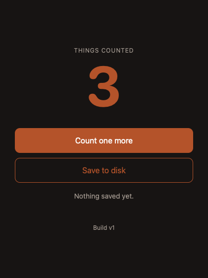
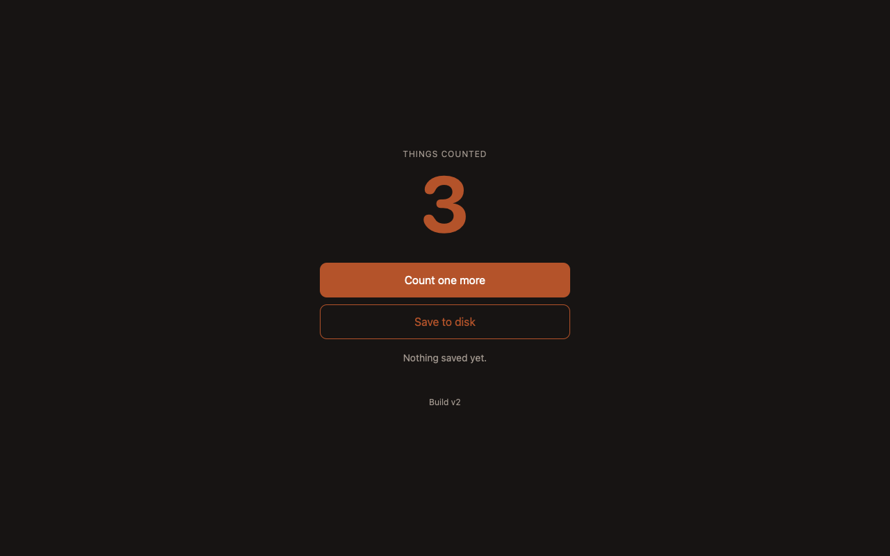

<div align="center">

# 🪞 Rusty Mirror

### Your real Tauri app, twice. The second one can't hurt anybody.

**A hidden, disposable, effect-denied twin of your actual app window,
for AI agents (and tired humans) to poke, screenshot and hot-swap.**

*Same renderer. Same bundle. Same state. None of the consequences.*

[Why](#the-problem) · [Proof](#proof) · [Install](#install) · [Wire it up](#wire-it-up) · [Drive it](#drive-it) · [For agents](#for-agents) · [Safety](#safety) · [Security](./SECURITY.md)

</div>

---

## The problem

Ask an AI agent to fix the UI of a Tauri app and it will, with great
confidence, open your frontend in a browser.

That page is a portrait of your app, painted by someone who has heard it
described. It is Chrome, not the WKWebView your users run. `invoke()` does
not exist, so the agent mocks it. The state is a fixture, because your real
state lives in Rust. Fonts, scrollbars, focus, transparency and scale factors
are all subtly different. The agent fixes the portrait, declares victory, and
your actual app is exactly as broken as it was.

The obvious alternative is worse: let the agent drive your *real* app. Now it
can click **Delete**, send the email, and rearrange your windows while you are
typing.

## The fix

Rusty Mirror opens a **second window inside your real app**: invisible,
unfocused, and wired to the same native webview, the same compiled frontend
and a snapshot of the same state. Then it takes the sharp objects away.

```text
 your app (one process)
 ├── main            the window you use. Untouched.
 └── rusty-mirror    invisible twin, seeded from main
       ├── storage   in memory; nothing persists
       ├── network   refused by a mirror-only CSP
       ├── invoke    allowlisted natively; effects rejected
       └── control   private unix socket ⇄ `rusty-mirror` CLI
```

An agent can open it, click around, run JavaScript, take **native**
screenshots, hot-swap a new frontend build into it, check the result, and
only then apply that build to your real window. Then it closes the mirror,
because it is not an animal.

## Browser stand-in vs Rusty Mirror

| | Browser stand-in | Rusty Mirror |
| --- | --- | --- |
| Renderer | Chrome / Chromium | Your app's own WKWebView |
| Frontend | Dev server, separate copy | The bundle your app is running |
| `invoke()` | Mocked or missing | Real, allowlisted per command |
| State | Fixtures | A snapshot of the live primary |
| Screenshots | Browser pixels | The native webview's pixels, window never shown |
| Side effects | Whatever the mocks forgot | Rejected at the native boundary |
| Your focus | Stolen by a browser window | Never touched |
| Ships to users | n/a | Compiled out; `rusty-mirror audit` proves it |

On macOS there is no WebDriver for WKWebView at all, which is why agents
reach for a browser in the first place. Rusty Mirror is the missing driver,
minus the part where it drives your actual car.

## Proof

The bundled end-to-end test builds [Tally](./examples/tally), an example app
with one read and one effect, launches it entirely off-screen and runs the
full loop with no human present:

```text
$ scripts/e2e.sh
   ok: mirror open, invisible and unfocused
   ok: seeded from the primary; clicks work locally
   ok: save_tally rejected, nothing written, primary state untouched
   ok: network, popups and persistent storage are fenced off
   ok: hidden native captures, resized, never overwritten
   ok: new revision loaded with the mirror's own state carried across
   ok: rollback is mirror-first; apply refuses an unverified embedded target
   ok: run closes the mirror on success and on failure
   ok: consumer frontend and binary carry no mirror; mirror builds are caught
e2e: PASS (16 checks)
```

These are its captures. Neither window was ever on screen. The mirror's
counter was clicked to 3, then a new frontend build was hot-swapped in at a
different size. The count survived. The build label did not, which was the
point.

<p align="center">
  
  
</p>

The mirror also tried to save to disk. Nothing interesting happened.

## Install

Rusty Mirror is two crates and a CLI. It is young (0.1) and lives on GitHub
for now.

```toml
# src-tauri/Cargo.toml
[features]
mirror-debug = ["dep:rusty-mirror"]   # private QA builds only

[dependencies]
rusty-mirror = { git = "https://github.com/michael-berardi/rusty-mirror", tag = "v0.1.0", optional = true }
```

```sh
cargo install --git https://github.com/michael-berardi/rusty-mirror --tag v0.1.0 rusty-mirror-cli
rusty-mirror --help
```

Requirements: Tauri 2.5+, Rust 1.80+. See [platforms](#platforms).

## Wire it up

Three small blocks in `main.rs`, all behind your feature:

```rust
let mut context = tauri::generate_context!();
#[cfg(feature = "mirror-debug")]
rusty_mirror::install_hot_assets(&mut context);          // 1. staged builds can be served

let handler: fn(tauri::ipc::Invoke) -> bool = tauri::generate_handler![get_tally, save_tally];
#[cfg(feature = "mirror-debug")]
let handler = rusty_mirror::guard(handler);               // 2. the mirror may only call allowlisted commands

let builder = tauri::Builder::default();
#[cfg(feature = "mirror-debug")]
let builder = builder.plugin(
    rusty_mirror::Builder::new().allow(["get_tally"]).build(),  // 3. read-only commands only
);
builder.invoke_handler(handler).run(context)?;
```

A few lines in your frontend, also gated, so the mirror gets your state and
not just your storage. With Vite, a `define` constant makes the consumer build
drop the whole block (verified with Vite 7):

```js
// vite.config.js:  define: { __RUSTY_MIRROR__: JSON.stringify(process.env.RUSTY_MIRROR === '1') }
if (__RUSTY_MIRROR__) {
  window.__RUSTY_MIRROR_SNAPSHOT__ = () => ({ tally });            // primary: hand it over
  const seed = window.__RUSTY_MIRROR_SEED__;                       // mirror: take it back
  if (seed?.state) tally = seed.state.tally;
}
```

And one rule for your capability files: never grant `"windows": ["*"]`. The
mirror's label is `rusty-mirror`; keep it out, and Tauri itself refuses its
plugin calls. `rusty-mirror audit --capabilities src-tauri/capabilities`
checks this for you.

The full walkthrough, including Vite and bundler-free setups, is in
[docs/integrate.md](./docs/integrate.md).

## Drive it

Build with the gate on, run your app as usual, then:

```sh
rusty-mirror open                                # invisible twin, 15 minute backstop
rusty-mirror eval 'return document.title'        # async JS body; JSON back
rusty-mirror capture shots/before.png            # native pixels, window stays hidden
rusty-mirror resize 1920x1080

# change code, rebuild the frontend, then:
rusty-mirror stage dist                          # immutable, hashed, offline
rusty-mirror refresh <revision>                  # mirror only; its state comes along
rusty-mirror capture shots/after.png             # look at it. Actually look.
rusty-mirror rollback                            # mirror-first, if you regret things
rusty-mirror apply                               # reload YOUR window on the verified build
rusty-mirror close                               # every session. Yes, every one.
```

Or let the CLI own the lifecycle, so the mirror closes even when your script
does not:

```sh
rusty-mirror run --seconds 600 -- ./qa/visual-check.sh
```

Every command prints one JSON document. Exit codes: `0` ok, `1` failed
(including a script that threw, or a capture that is one flat colour), `2`
usage, `3` audit found mirror code where it must not be. Reference:
[docs/cli.md](./docs/cli.md).

## For agents

Rusty Mirror was built to be driven by agents with nobody watching. The
repository ships an agent skill:

```sh
cp -R skills/rusty-mirror ~/.claude/skills/      # or your agent's skills directory
```

It teaches the workflow that actually produces evidence: prove the mirror
works before polishing anything, exercise real states rather than fixtures,
inspect every capture individually, never show or focus the mirror, and
close it at the end of every session. A screenshot file that exists is not a
screenshot that was checked.

## Safety

The mirror is for trusted code, your own, running where it might otherwise
do something regrettable. The layers, outermost first:

- **Compiled out of consumer builds.** No feature, no mirror. `rusty-mirror audit`
  checks frontends, binaries and `.app` bundles for any trace.
- **Native command allowlist.** `guard` rejects every app command from the
  mirror window that you did not allow. A forgetful frontend cannot save,
  send, delete or spawn.
- **Tauri capabilities.** Plugin commands are refused because no capability
  names the mirror window.
- **Mirror-only CSP.** No outbound network, frames, forms or popups.
- **Memory-only storage** seeded from the primary; incognito webview.
- **Same-user socket.** A 0700 directory, a 0600 socket, and a peer UID check.
- **Finite life.** A 1–3600 second deadline backs up an explicit `close`.

What it is not: an OS sandbox. Read [docs/security.md](./docs/security.md)
for the exact threat model and its edges.

## Platforms

| | Mirror, eval, stage, refresh, apply | Native capture |
| --- | --- | --- |
| macOS 14+ | Supported, tested end to end | `WKWebView.takeSnapshot`, no Screen Recording permission |
| Linux | Core and CLI compile; plugin not yet built or tested | Not yet |
| Windows | Not yet (no socket transport) | Not yet |

Pull requests for WebKitGTK and WebView2 captures are extremely welcome.

## Origins

Rusty Mirror is the generalised form of the native mirror QA tooling built
for UltraTerm and UltraVox, where agents polish desktop apps all day and a
browser mock was never going to cut it. Two apps had grown two copies of the
same idea; this is the third and, with luck, final one.

## Contributing

Issues and pull requests welcome. Run `cargo test`, `cargo clippy`, and on
macOS `scripts/e2e.sh` before opening a PR. See
[CONTRIBUTING.md](./CONTRIBUTING.md).

## License

MIT © Implose Cybernetics. See [LICENSE](./LICENSE).
